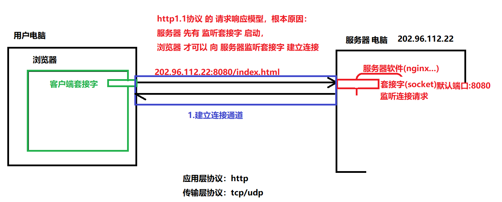
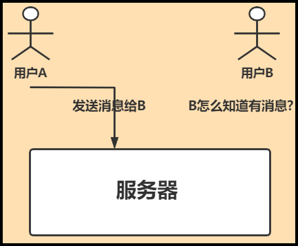
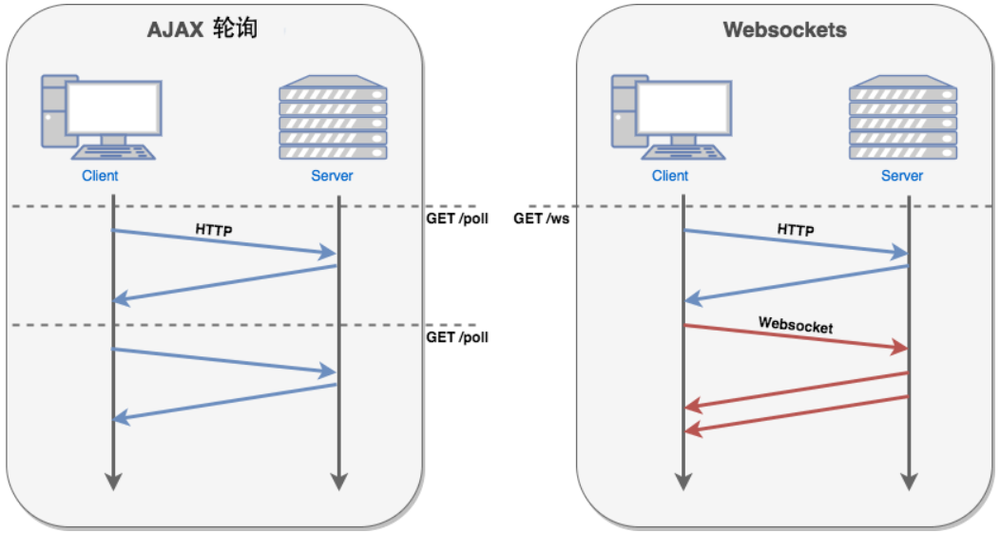
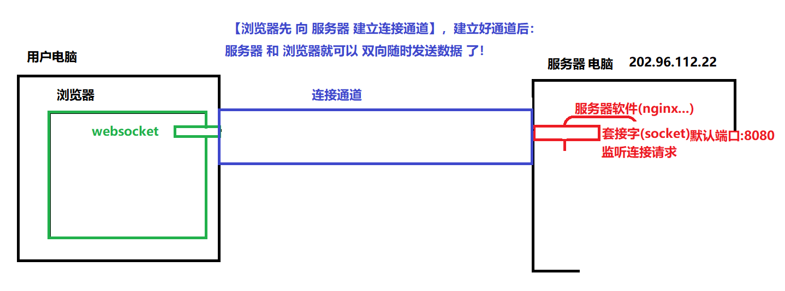
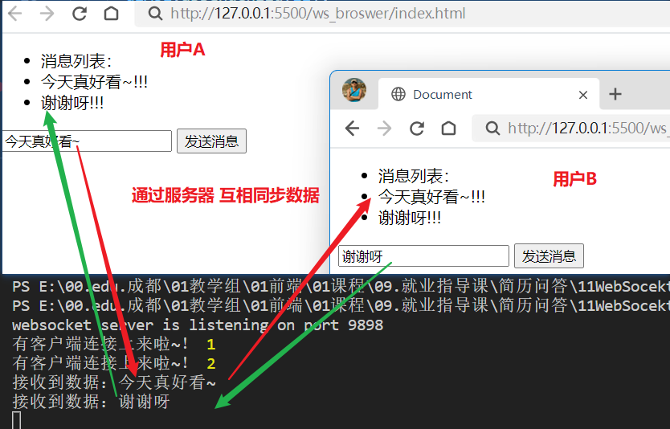

## 1.浏览器服务器交互

+ 业务需求：
  + 浏览器中 实时聊天、股票实时数据显示等功能，http 处理不了！

### 1.1 http协议模式

+ http协议1.1 使用的是 **请求响应模型**：
  + 服务器软件启动后，会开启监听套接字
  + 浏览器请求时，先与服务器建立连接通道（内部会创建 服务器的通信套接字）
  + 再向 服务器 发送 请求报文
  + 服务器 再生成 响应报文 发给 浏览器
+ **一句话**：必须 是 浏览器先请求，服务器才能发数据给浏览器！



### 1.2 浏览器获取即时数据

+ 需求：在线聊天，A怎么知道什么时候B给他发送的数据呢？又怎么拿到呢？



+ 两种方案：
  + 轮询：说白了，就是 每隔多少秒就去服务器"问"一下是否有数据
    + 缺点：
      + 缺乏消息的即时性
      + 查询次数太多，服务器压力大
  + websocket：一旦建立连接通道后，服务器可以主动向浏览器发送数据
    + 缺点：需要维持一个连接通道
    + 优点：服务器可以主动向浏览器发送数据




## 2.websocket通信

### 2.1 什么是websocket

> WebSocket是HTML5新增的协议，它的目的是在浏览器和服务器之间建立一个不受限的双向通信的通道，比如说，服务器可以在任意时刻发送消息给浏览器。

+ WebSocket 协议主要为了解决 HTTP/1.x 缺少双向通信机制的问题,
  + 使用 TCP 作为传输层协议,
  + 使用 HTTP Upgrade 机制来握手,
  + WebSocket 使用与 HTTP 相同的 80 (WebSocket over TCP) 和 443 (WebSocket over TLS) 端口,
  + 与 HTTP 是相互独立的协议, 二者没有上下的分层关系




### 2.2 案例:简易在线聊天室



#### 2.2.1 服务端

+ 下载 `nodejs-websocket` 包

+ 创建文件 `app.js`：

```js
// 1.导入websocket node对象
var ws = require("nodejs-websocket")

// 创建 连接通道 数组
var connList = []

// 2.创建websocket服务器 ,conn -> 连接通道
var server = ws.createServer(function (conn) {
  // 2.0 将连接通道 添加到数组中保存
  connList.push(conn)
  // 2.1 连接成功，conn 与客户端的连接通道
  console.log("有客户端连接上来啦~！", connList.length)

  // 2.2 接收客户端发送的数据事件
  conn.on("text", function (str) {
    // 2.3 打印接收到的数据
    console.log("接收到数据：" + str)
    // 2.4 遍历连接数组，并发送数据
    for (var i = 0; i < connList.length; i++) {
      // 2.5 将数据发送给当前连接的客户端
      connList[i].sendText(str.toUpperCase() + "!!!")
    }
  })

  // 2.3 关闭连接事件：连接通道被关闭时触发
  conn.on("close", function (code, reason) {
    console.log("当前连接被关闭！原因->", reason)
    // 2.4 将当前连接通道从数组中移除
    connList.splice(connList.indexOf(conn), 1)
    console.log("当前连接数量：", connList.length)
  })

  // 2.4 异常事件：连接通道出现异常时触发
  conn.on("error", function (code, reason) {
    console.log("异常事件：", reason)
  })

}).listen(9898, function () {
  console.log('websocket server is listening on port 9898')
})

```

#### 2.2.2 浏览器端

+ 新建页面` index.html`

```html
<!DOCTYPE html>
<html lang="en">

<head>
  <meta charset="UTF-8">
  <meta http-equiv="X-UA-Compatible" content="IE=edge">
  <meta name="viewport" content="width=device-width, initial-scale=1.0">
  <title>Document</title>
</head>

<body>
  <ul id="ulMsg">
    <li>消息列表：</li>
  </ul>
  <input type="text" id="txtMsg">
  <button id="btnSend">发送消息</button>
  <script>
    // webSocekt 客户端案例！
    // 1.创建 websocket，并与服务器 建立连接通道
    var ws = new WebSocket("ws://localhost:9898");
    // 2.设置 websocket 接收消息事件
    ws.onmessage = function (e) {
      console.log(e.data);
      // 2.1 将消息 添加到 ul中
      var ulMsg = document.getElementById("ulMsg");
      var li = document.createElement("li");
      li.innerHTML = e.data;
      ulMsg.appendChild(li);
    };
    // 2.为按钮添加点击事件
    document.querySelector('#btnSend').onclick = function () {
      // 3.获取文本框中的值
      var msg = document.querySelector('#txtMsg').value.trim() ?? '你好，我是客户端';
      // 3.发送消息
      ws.send(msg);
    }
  </script>
</body>

</html>
```

