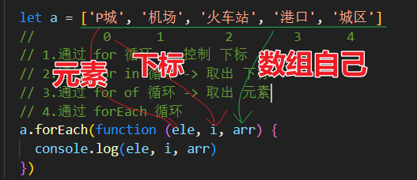

## 数组面试题

+ 什么是数组？
  + 通俗：就是可以存放多个数据的盒子
  + 本质：JS内存中的一个“对象”，下标 是 对象【属性名】，值 是 对象【属性值】
+ 语法：

```js
// 数组的 字面量表示法
let arr1 = [5,4,6,8,2,1]
let arr2 = [ 
    {name:'小欣欣',age:29},
    {name:'小梅梅',age:380} 
]

// new 数组对象
let arr3 = new Array(5,4,6,8,2,1) // arr3.__proto__ -> Array.prototype
```

### 1.操作数组

#### 1.1 新增元素

```js
// 1. 新增方法： ------------------------------------
// a.尾部新增
arr.push(10, 11) // 尾部新增 元素
arr.push(...[110, 112, 119])  // 展开运算符，相当于 arr.push(110,112,119)

// b.头部新增
arr.unshift(0, 1) // 头部新增 元素
```

#### 1.2删除元素

+ splice 删除 指定下标的元素

+ pop 尾部取出
+ shift 头部取出

```js
// 2. 删除 指定下标的元素 -----------------------------------
let arr2 = [5, 4, 6, 8, 2, 1]
//          0  1  2  3  4  5
// a.从某个下标开始 一直删除到最后，并返回 删除元素 组成的新数组
let s1 = arr2.splice(3) //  [5, 4, 6]
console.log(s1)

// b. 删除 指定下标的元素
// arr2.splice(3, 2) // [5, 4, 6, 8]

// c. 删除 头部第一个元素，并返回
let first = arr2.shift() // [4, 6, 8, 2, 1]

// d.删除 尾部第一个元素，并返回
let last = arr2.pop() // [4, 6, 8, 2]
```

#### 1.3 替换元素

+ splice(下标，数量，新元素) 替换 指定下标的元素

```js
// 3. 替换 指定下标的元素 -----------------------------------
let arr3 = [5, 4, 6, 8, 2, 1]
//          0  1  2  3  4  5
arr3.splice(3, 1, 'a') // [5, 4, 6, 'a', 2, 1]
arr3.splice(3, 2, 'a') // [5, 4, 6, 'a', 1]
```

#### 1.4 查找元素下标

+ indexOf / findIndex

```js
let arr = ['P城', '机场', '火车站', '港口', '城区'];
//           0      1        2        3      4

// 1.查找 指定元素的 下标，没有的话返回 -1
let index = arr.indexOf('火车站');
console.log(index) // true

// 2.按条件 查找 指定元素的 下标
let arr2 = [
    { name: 'P城', num: 100000 },
    { name: 'Y城', num: 100000 },
    { name: '机场', num: 100000 },
    { name: 'Y城', num: 100000 },
]

// findIndex 根据 条件 查找 满足条件的 第1个元素的 下标，没有的话返回 -1
let index2 = arr2.findIndex(function (ele, i) {
    return ele.name == 'Y城1'
})
console.log(index2) // false
```

#### 1.5 判断是否存在

+ includes / some

```js
    let arr = ['P城', '机场', '火车站', '港口', '城区'];
    //           0      1        2        3      4
    // 判断是否存在，返回 bool 值
    let a = arr.includes('火车站1')
    console.log(a) // true

    // 判断是否存在，返回 bool 值
    let arr2 = [
      { name: 'P城', num: 100000 },
      { name: 'Y城', num: 100000 },
      { name: '机场', num: 100000 },
      { name: 'Y城', num: 100000 },
    ]

    // 根据条件 判断 是否存在元素，返回 bool 值
    let b = arr2.some(function (ele, i) {
      return ele.name == 'Y城'
    })

    console.log(b) // true
```

#### 1.6 截取片段

+ slice( 开始下标 , 结束下标 ) 
+ 注意：不包含结束下标，不影响原数组，而是返回新数组

```js
let arr = ['P城', '机场', '火车站', '港口', '城区'];
//           0      1        2        3      4

// slice【取出 下标 1开始的2个元素，不修改原数组】
// slice(开始下标，结束下标) 不包含结束下标
let a = arr.slice(1, 4)
console.log(arr)
console.log(a)
```

#### 1.7 拼接数组

+ concat 不影响原数组，返回新数组

```js
let arr = ['P', '机', '火', '港', '城'];
//          0    1     2     3     4

// 返回一个新数组，包含 原数组 和 参数数组
// let arr1 = arr.concat(1, 3) // ['P', '机', '火', '港', '城',1,3]

// 自动 将 子数组的元素 逐一 加到 新数组中
let arr1 = arr.concat([1, 2, 3])// ['P', '机', '火', '港', '城',1,2,3]
```

#### 1.8 将数组 拼接成字符串

+ 数组.join('分隔符')，返回拼接后的字符串
+  字符串.split('分隔符')，按照 分隔符 将数组拆成 子字符串，添加到数组中返回

```js
let arr = ['P城', '机场', '火车站', '港口', '城区'];
//           0      1        2        3      4

// 1.join 将数组元素 按分隔符 拼接成 字符串返回
let str = arr.join('_')
console.log(str) // 'P城_机场_火车站_港口_城区'

// 2.字符串的split方法：将字符串转成数组：P城_机场_火车站_港口_城区 -> 转成 数组
let arr1 = str.split('_')
console.log(arr1) // ['P城', '机场', '火车站', '港口', '城区']
```


#### 1.9 翻转数组

+ reverse 数组方法，反转数组

```js
let a = ['P城', '机场', '火车站', '港口', '城区']
a.reverse() // ['城区', '港口', '火车站', '机场', 'P城']
```


### 2.新增方法

#### 2.1 循环数组

```js
let a = ['P城', '机场', '火车站', '港口', '城区']
//         0      1        2        3      4
// 1.通过 for 循环 -> 控制 下标
for (let i = 0; i < a.length; i++) {
    console.log(a[i]) // P城 机场 火车站 港口 城区
}
// 2.通过 for in 循环 -> 取出 下标
for (let i in a) {
    console.log(a[i]) // 0 1 2 3 4
}
// 3.通过 for of 循环 -> 取出 元素
for (let i of a) {
    console.log(i) // P城 机场 火车站 港口 城区
}
```

#### 2.2 foreach 遍历数组

```js
// 4.通过 forEach 循环
let a1 = a.forEach(function (ele, i, arr) {
    console.log(ele, i, arr)
})
```




#### 2.3 map

```js
// 5.map 用来修改数组的元素，装入新数组 返回------------
let b = a.map(function (ele, i, arr) {
    ele += '_讨厌'
    return ele
})
// 修改了每一个元素
console.log(b) // ['P城_讨厌', '机场_讨厌', '火车站_讨厌', '港口_讨厌', '城区_讨厌']
```

#### 2.4 reduce

+ reduce 接收一个函数作为**累加器**，循环遍历数组元素进行**算数运算**，最终计算为一个值。

```js
let a = [1, 2, 3, 4, 4, 5, 6, 7, 8, 9, 10];
// 需求：求元素之和
// 方式一：for循环---------------------------------
let sum = 0
for (let i = 0; i < a.length; i++) {
  sum += a[i]
}
console.log(sum)

// 方式二：reduce方法 -----------------------------
// 本质 是帮助 做类似 求和运算的方法
let res = a.reduce(function (sum, cur, i) {
  return sum + cur
}, 0)

console.log(res)
```


#### 2.5 filter

+ filter 返回符合条件的元素 组成的新数组

```js
let a = [1, 2, 3, 4, 4, 5, 6, 7, 8, 9, 10];

// 1.filter 根据条件 筛选 元素 装入 新数组 后 返回
let arr = a.filter(function (ele, i) {
  // 如果 返回true,则 将 ele 加入 新数组中返回
  return ele > 5 && ele < 9
})

// 打印 筛选后的 新数组
console.log(arr) // [6, 7, 8]
```

#### 2.6 find

+ 返回符合条件的 第一个元素，并立即停止循环

```js
// 2.find 返回第一个 符合条件的元素
let arr1 = [
  { name: '花花', age: 12 },
  { name: 'ruiky', age: 2 },
  { name: '小欣欣', age: 38 },
  { name: '小梅梅', age: 38 },
]

let res = arr1.find(function (ele, i) {
  // 如果 返回true,则 返回 这个元素，并 立即 停止 find内部的 循环
  return ele.age === 38
})

console.log(res) // { name: '小欣欣', age: 38 }
```

#### 2.7 some和every

+ some：只要有一个元素符合条件，就返回 true 

+ every：只有当 所有元素 都符合条件，才返回true

```js
let a = [
    { name: '花花', age: 12 },
    { name: 'ruiky', age: 2 },
    { name: '小欣欣', age: 38 },
    { name: '小梅梅', age: 38 },
]
// 1.some：只要有一个元素符合条件，就返回 true
let res1 = a.some(function (ele, i) {
    return ele.age === 2
})

console.log(res1) // true

// 2.every：只有当 所有元素 都符合条件，才返回true
let res2 = a.every(function (ele, i) {
    return ele.age >= 2
})

console.log(res2) // true
```


#### 2.8 flat 平铺数组

+ 按照一个可指定的深度递归遍历数组，并将所有元素与遍历到的子数组中的元素合并为一个新数组返回

```js
// 普通平铺合并数组
console.log([1,4,[2, 3],5].flat()); // [1,4,2,3,5]
 
// 指定平铺合并的嵌套层数(2层)
console.log([1, [2, [3, [4, 5]]]].flat(2)); // [1, 2, 3, [4, 5]]
 
// 平铺合并所有层数的数组
console.log([1, [2, [3, [4, 5]]]].flat(Infinity)); // [1, 2, 3, 4, 5]
 
// 自动跳过空位【会移除数组中的空项】
console.log([1, [2, , 3]].flat()); // [1, 2, 3]
```


### 3.快速复习

```js
let a = ['a','b','c','d','e']
              0  1   2  3  4
a.push('e')     尾部新增
a.unshift('a')  头部新增

a.splice(2,1) // 删除指定下标元素

a.splice(3,1,'爱') // 替换指定下标元素

a.indexOf('b') -> 1 // 查找元素下标
a.indexOf('x') -> -1

a.includes('x') -> false // 判断元素存在
a.includes('c') -> true

let b = a.slice(0,2) // ['a','b'] // 截取生成新数组

let b = a.concat([1,2,3]) // ['a','b','c','d','e',1,2,3] // 拼接生成新数组

a.push(1,2,3) // ['a','b','c','d','e',1,2,3]        // 对原数组做新增
a.push([1,2,3]) // ['a','b','c','d','e',[1,2,3]]
a.push(...[1,2,3]) // ['a','b','c','d','e',1,2,3]
```


## 常见数组面试题

### 0.数组排序

+ arr.sort 专门用来 对数组做排序

```js
// 1.为数字数组做排序 --------------------------------------
let nums = [6, 4, 2, 8, 2, 9, 10, 1, 3, 5, 7];
//  sort 方法内部 会 使用 合适的 排序算法，对数组 做排序
//       但是，只要 是 排序，就一定存在 比较两个数据 谁大谁小的问题！
//                          只有知道 大小，才能决定 谁在前面，谁在后面~！
nums.sort(function (prev, next) {
    // 返回 正数：说明 prev>next 
    // 返回 负数：说明 prev<next 
    // 返回 0：说明 prev=next ,那么就不交换位置

    // return prev - next; // 正序：从小到大排列
    return next - prev; // 倒序：从大到小排列
})
console.log(nums)

// 2.为 对象数组 做排序 --------------------------------------
let arr1 = [
    { name: '花花', age: 12 },
    { name: 'ruiky', age: 2 },
    { name: '小欣欣', age: 18 },
    { name: '小梅梅', age: 9 },
]
arr1.sort(function (prev, next) {
    // return prev.age - next.age
    return next.age - prev.age
})
console.log(arr1)


// 3.为 字符串数组 做排序 --------------------------------------
// 如果 都是 英文，则 按照 字母的 ascii码 顺序排列
// 如果 都是 中文，则 按照 中文字符集的 对应 数字 顺序排列
let a = ['P城', '机场', '火车站', '港口', '城区']
a.sort(function (prev, next) {
    return prev.charCodeAt() - next.charCodeAt()
})
console.log(a) //['P城', '城区', '机场', '港口', '火车站']


// str.charCodeAt 方法，返回 字符串的 对应的 ascii码
// console.log('机'.charCodeAt())
// console.log('场'.charCodeAt())
// console.log('机场'.charCodeAt())
```


### 1.数组去重

#### 1.1 利用set

```js
var arr=[1,2,3,2,9]
var newarr = [...new Set(arr)]
console.log(newarr);//[1, 2, 3, 9]

```

#### 1.2 利用indexOf

```js
var arr=[1,2,3,2,9]
function fn(arr){
    var newarr=[]
    arr.filter((item,index)=>{
        if(newarr.indexOf(item)==-1){
            newarr.push(item)
        }
    })
    return newarr
}
console.log(fn(arr));//[1, 2, 3, 9]

```

#### 1.3 利用includes

```js
var arr=[1,2,3,2,9]
function fn(arr){
    var newarr=[]
    arr.filter((item,index)=>{
        if(!newarr.includes(item)){
            newarr.push(item)
        }
    })
    return newarr
}
console.log(fn(arr));

```

#### 1.4 利用reduce

```js
var arr=[1,2,3,2,9]
function fn(arr){
    var newarr=[]
    arr.sort().reduce((pre,value,index)=>{
        //比较pre中最后一个元素和当前的值是否相等，不相等加入新数组
         if (pre[index-1]!==value) {
            newarr.push(value)
         }
         return newarr
    },[])
    return newarr
}
console.log(fn(arr));

```

### 2.数组扁平化

#### 2.1 利用flat

注意此api不传参数就只能深度到1，参数代表着深度，当不知道深度时可以传Infinity

```js
var arr=[1,2,3,2,9,[2,3,[1]]]
console.log(arr.flat());//[1, 2, 3, 2, 9, 2, 3, Array(1)]
var arr=[1,2,3,2,9,[2,3,[1]]] 
console.log(arr.flat(Infinity));//[1, 2, 3, 2, 9, 2, 3, 1]

```

#### 2.2 利用reduce

```js
var arr=[1,2,3,2,9,[2,3,[1]]]
function flat(arr){
    return arr.reduce((pre,value,index)=>{
        return pre.concat(Array.isArray(value)?flat(value):value)
    },[])
}
console.log(flat(arr));//[1, 2, 3, 2, 9, 2, 3, 1]

```

#### 2.3 将数组转为字符串，再转为数组

```js
var arr=[1,2,3,2,9,[2,3,[1]],[2,3]]
//数组转为字符串，再将字符串转为数组
var newarr = arr.join(',').split(',').map((item,index)=>{
    return parseInt(item)
})
console.log(newarr);//[1, 2, 3, 2, 9, 2, 3, 1, 2, 3]

```

### 3.判断数组元素出现个数

+ 例如：var arr=['name','age','hhh','hhh']各出现多少次

```js
var arr=['name','age','hhh','hhh']
var newarr = arr.reduce((pre,item,index)=>{
    if (!pre[item]) {
        pre[item]=1
    }else{
        pre[item]++
    }
    return pre
},{})
console.log(newarr);

```

### 4.判断数组中出现次数最多的元素

+ 在统计个元素出现个数的基础上

```js
var arr=['name','age','hhh','hhh']
var newarr = arr.reduce((pre,item,index)=>{
    if (!pre[item]) {
        pre[item]=1
    }else{
        pre[item]++
    }
    return pre
},{})
var max=0//最多的数量
var attr//最多的属性是什么
for (const key in newarr) {
    //key为属性
    console.log(newarr[key]);
    if (newarr[key]>max) {
        max=newarr[key]
        attr=key
    }
}
console.log(max,attr);

```

### 5.统计数组中重复的元素

```js
var arr=[1,2,6,2,9,1]
console.log(arr.sort());
var arr2=[]
arr.sort().sort((e1,e2)=>{
    e1===e2?arr2.push(e2):''
})
console.log(arr2);

```

### 6.在a不在b

现在两个数组，判断在a中的元素，不在b中 const a = [1,2,3,5] const b=[1,3,5,6]

```js
const a = [1,2,3,5]
const b=[1,3,5,6]
const newarr = a.filter((item,index)=>{
//将在a不在b中的筛选出来
   return b.indexOf(item)==-1
})
console.log(newarr);
```

### 4.综合题

+ 判断数组元素出现个数

```js
// 综合习题
// 公司前后招聘了10个员工(性别,年龄, 月薪各不相同),有以下需求
// 1). 列表显示所有员工的所有信息 
// 2). 对员工进行年薪降序列表显示  
// 3). 得到男员工的总月薪
// 4). 查找一个月薪只比12000高一点点的员工
// 5). 查找出所有月薪高于12000的员工
const employees = [
   {name: 'A', sex: '男', age: 21, salary: 10000},
   {name: 'B', sex: '女', age: 25, salary: 12000},
   {name: 'C', sex: '男', age: 24, salary: 13000},
   {name: 'D', sex: '男', age: 24, salary: 12500},
   {name: 'E', sex: '女', age: 21, salary: 14000},
   {name: 'F', sex: '男', age: 24, salary: 16000},
   {name: 'G', sex: '男', age: 23, salary: 9000},
   {name: 'H', sex: '女', age: 21, salary: 11000},
   {name: 'I', sex: '男', age: 23, salary: 13200},
   {name: 'J', sex: '男', age: 23, salary: 15000}
]

1)employees.forEach((item,index)=>{
    console.log(item);
})

2)var newArr= employees.sort((e1,e2)=>{
    return e2.salary-e1.salary
})
console.log(newArr);

3)var newArr= employees.reduce((pre,item)=>{
    return pre = item.sex==='男'?pre+item.salary:0
},0)
console.log(newArr);

4)var newArr= employees.sort((e1,e2)=>{
    return e1.salary-e2.salary
}).find((item,index)=>{
    return item.salary>12000
})
console.log(newArr);

5)var newArr = employees.filter((item,index)=>{
    return item.salary>12000
})
console.log(newArr);
```


