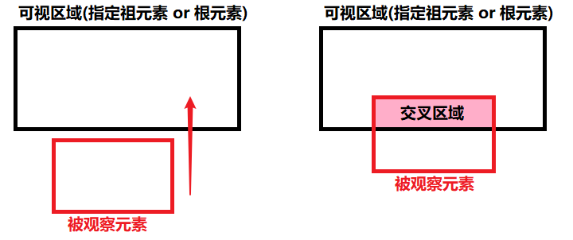
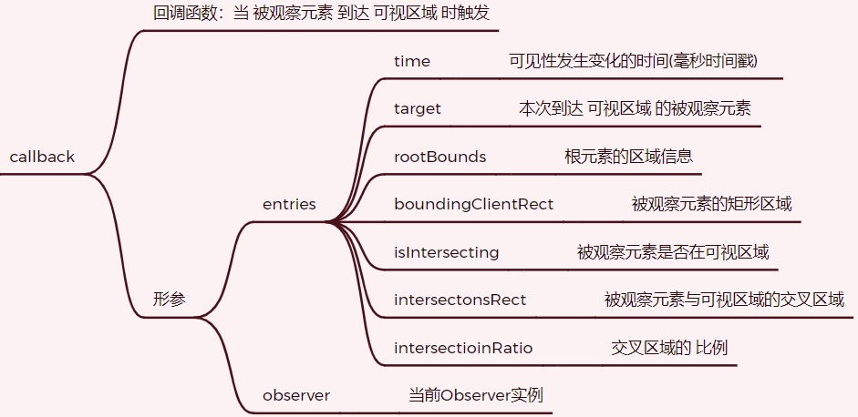
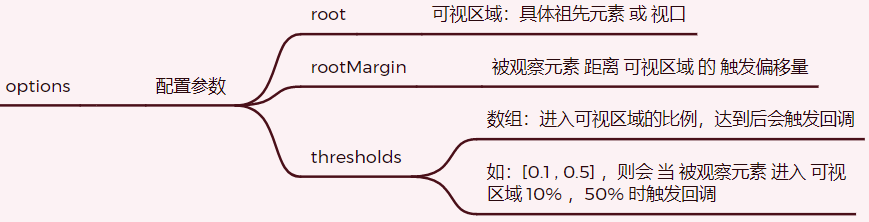
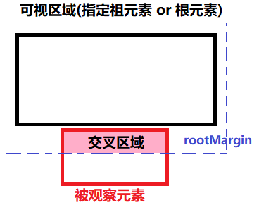
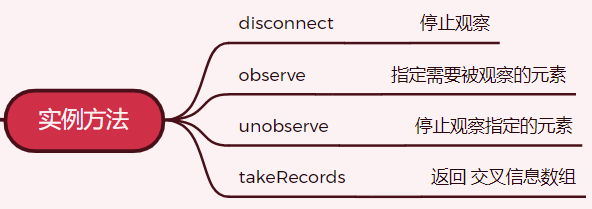

## IntersectionObserve

### 1.为什么要用？

+ 需求：图片延迟加载(懒加载，按需加载)，需要判断图片进入**可视区域**，怎么办？
+ 方案：
  + a.监听 scroll 事件，不断判断目标元素 离页顶的距离是否到**可视区域**
    + 缺点：由于是依赖于浏览器的**主线程**进行的同步侦测，会导致性能差，容易卡顿
  + b.通过 **IntersectionObserve** 实现，依赖于浏览器底层的**异步方式**来判断是否达到**可视区域**
    + 缺点：有较低的延时，但由于异步，减少了对DOM和style查询的昂贵计算和持续轮询，相比传统方式降低了CPU、GPU的消耗
    + 优点：不会因为占用主线程而造成页面卡顿，因为是用子线程来观察的！

### 2.IntersectionObserve是啥？

> IntersectionObserve(交叉观察器) 是webapi内置的一个构造函数，用于更方便的处理元素是否到达可视区域

+ MDN：https://developer.mozilla.org/zh-CN/docs/Web/API/IntersectionObserver
+ 通俗：浏览器提供的**异步监控**被观察元素出现在指定可视区域后，触发回调函数的机制！



### 3.语法

#### 3.1 构造函数

+ 语法：`IntersectionObserver(callback, options)`

+ 参数：

  + **callback：当 被观察元素 到达 可视区域 时触发**

  

  + **options：配置参数**

  

  + **rootMargin图解** ：只要进入 rootMargin区域 就相当于 进入 可视区域了！



#### 3.2 实例函数



### 4.小案例

```html
<!DOCTYPE html>
<html lang="en">
<head>
  <meta charset="UTF-8">
  <meta http-equiv="X-UA-Compatible" content="IE=edge">
  <meta name="viewport" content="width=device-width, initial-scale=1.0">
  <title>IntersectionObserve</title>
</head>
<body>
  <div id="viewport">
    <div id="box1">
      <div id="observed"></div>
    </div>
  </div>
  <script>
    // 1.获取 页面上指定的 可视区域
    const vp = document.querySelector('#viewport'); // 可视区域
    const ob = document.querySelector("#observed"); // 被观察元素
    // 2.设置 交叉观察 的配置信息
    let options = {
      root: vp, // 设置 可视区域
      threshold: [0, 0.5, 1], // 指定 触发比例 时机
      rootMargin: '30px 100px 20px' // 指定 被观察元素 距离 可视区域的 触发偏移量
    }
    // 3.创建 交叉观察 的实例
    let firstObserve = new IntersectionObserver(callback, options);
    // 4.回调函数
    function callback(changes) {
      console.log('有被观察元素进入 可视区域啦：', changes)
    }
    // 5.监听 被观察元素
    firstObserve.observe(ob)
  </script>
</body>

  <style>
    #viewport {
      width: 300px;
      height: 400px;
      border: 1px solid blue;
      overflow: auto;
    }
    #box1 {
      border: 1px solid #000;
      height: 400px;
      width: 270px;
    }
    #observed {
      margin-top: 500px;
      width: 100px;
      height: 100px;
      background: red;
    }
  </style>
</html>
```

### 5.使用场景

+ 计算元素的可视性

+ 构建自定义的预加载或延迟加载DOM和数据

+ 实现高性能的滚动列表

+ ......

