> 复习 git 用

## 一.Git介绍

### 1.概念

+ 官网：https://git-scm.com
+ 官方文档：https://git-scm.com/book/zh/v2

+ **Git** 是一个【开源分布式版本控制系统】，是目前世界上最先进最流行的版本控制系统。
  可以快速高效地处理从很小到非常大的项目版本管理

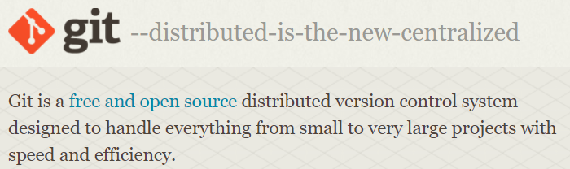

### 2.Git 的特性

+ 直接记录快照（完整备份），而非差异比较
+ 近乎所有操作都是本地执行

## 二.Git本地仓库

### 1.首次使用

+ git 需要知道我们的 用户名 和  邮箱，用来在每次操作时记录操作人

```git
git config --global user.name "用户名"
git config --global user.email "邮箱-推荐自己的常用邮箱"
```

+ 本质：保存在了 配置文件中，也可以自己直接写进去 或 直接修改

  `C:/Users/用户名文件夹/.gitconfig`

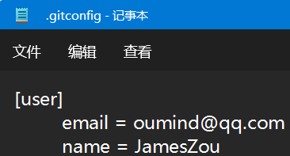

### 2.基本操作

+ 创建本地仓库 `git init`

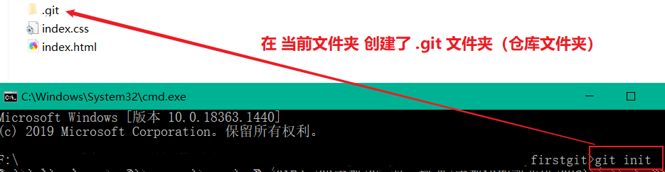

+ 添加文件到 暂存区 `git add .` 
+ 提交生成新版本 `git commit -m'备注'`
+ 邹芬奇图：

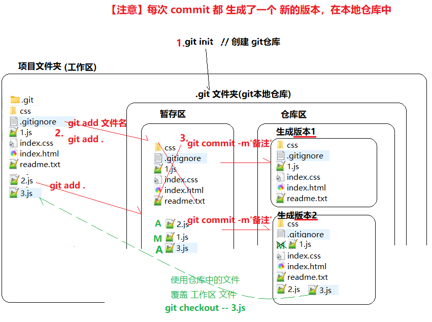

### 3.删除文件

+ 其实真实操作的话，直接删除 工作区文件，重新 add 和 commit 就可以了
+ 这里只是 让大家对 版本的理解更深入一点

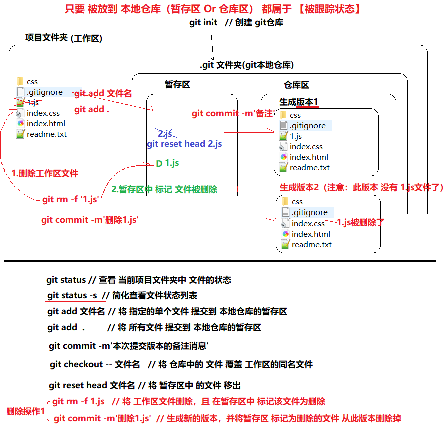


### 4.版本控制

+ 查看 当前和之前 详细版本 `git log`
+ 查看 当前和之前 版本简表 `git log --pretty=oneline`
+ 切换版本 `git reset --hard 版本号`
+ 查看 所有版本 `git reflog --pretty=oneline`

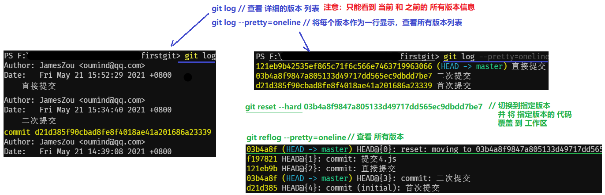

### 5.git忽略文件

> 当你使用`git add .`的时候有没有遇到把你不想提交的文件也添加到了缓存中去？比如项目的本地配置信息，如果你上传到Git中去其他人pull下来的时候就会和他本地的配置有冲突，所以这样的个性化配置文件我们一般不把它推送到git服务器中，但是又为了偷懒每次添加缓存的时候都想用`git add .`而不是手动一个一个文件添加，该怎么办呢？很简单，git为我们提供了一个.gitignore文件只要在这个文件中声明你不希望添加到git中去的文件，这样当你使用`git add .`的时候这些文件就会被自动忽略掉

+ 工作区新建一个名称为`.gitignore`的文件
+ 语法：

``` git
# 忽略指定文件
a.js

# 忽略指定文件夹 如：/assets，但不忽略 /sub/assets
/assets/

# 忽略任何同名文件夹
assets/
node_modules/bin/

# 忽略.class的所有文件
*.jpg

# 忽略名称中末尾为ignore的文件夹
*ignore/

# 忽略名称中间包含ignore的文件夹
*ignore*/
```

## 三.Git远程仓库

### 1.本地仓库管理远程仓库地址

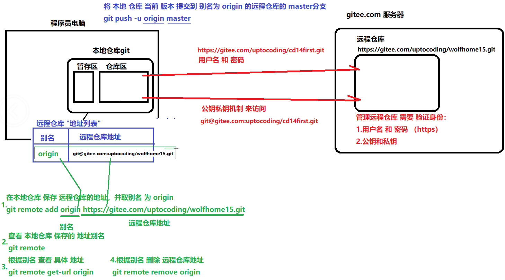

### 2.生成公钥私钥

+ gitee说明：https://gitee.com/help/articles/4181
+ 通过工具生成：`ssh-keygen -t ed25519 -C "xxxxx@xxxxx.com"`

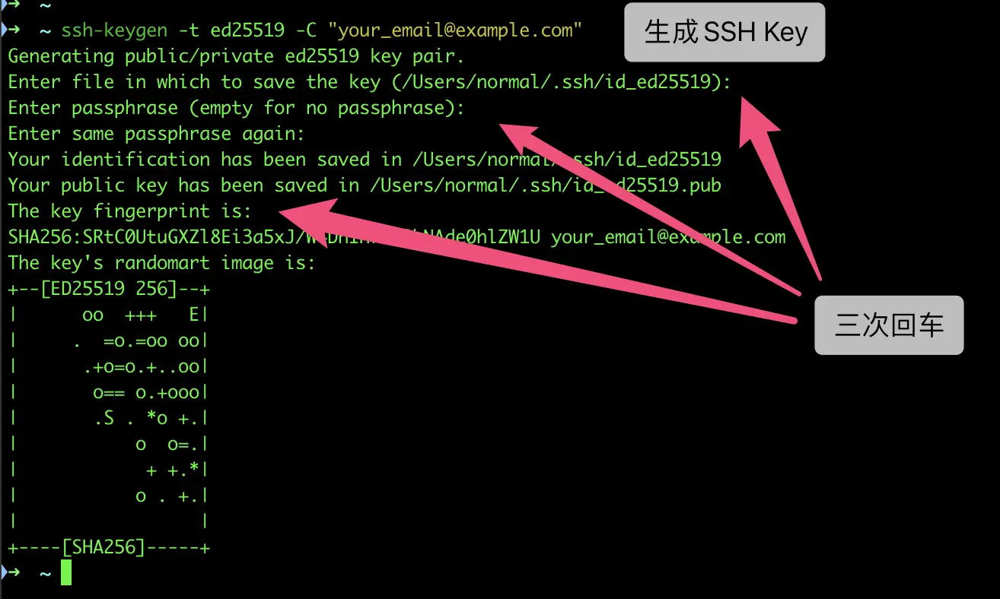

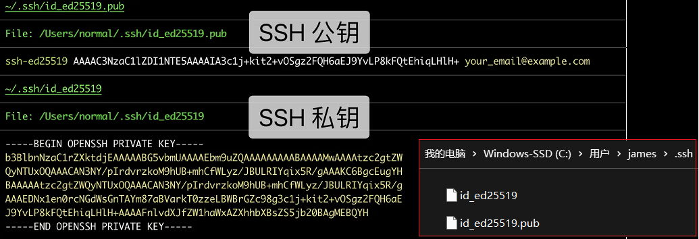

### 3.配置公钥

+ 用处

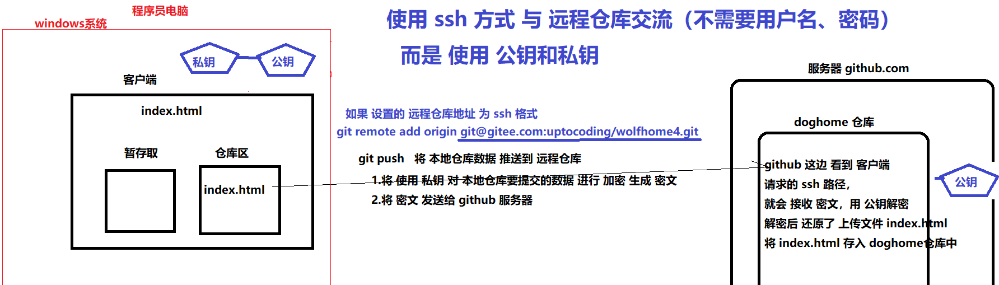

+ 配置

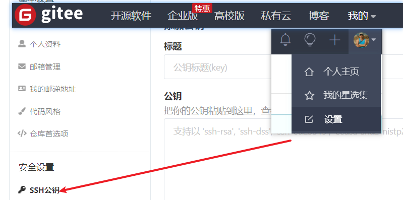

### 4.远程仓库

+ 关联远程仓库 `git remote add origin 远程仓库地址`
+ 首次提交 `git push -u origin master`
+ 非首次提交 `git push`

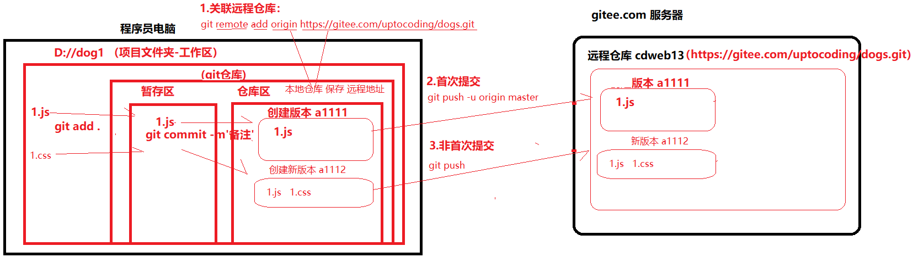

### 5.分支与版本关系

+ 每个分支 有自己的版本体系

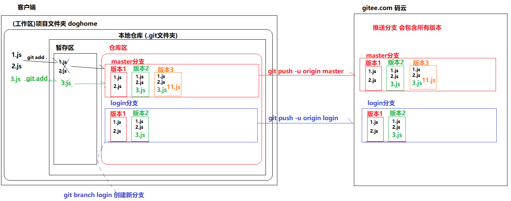

## 四.常见命令

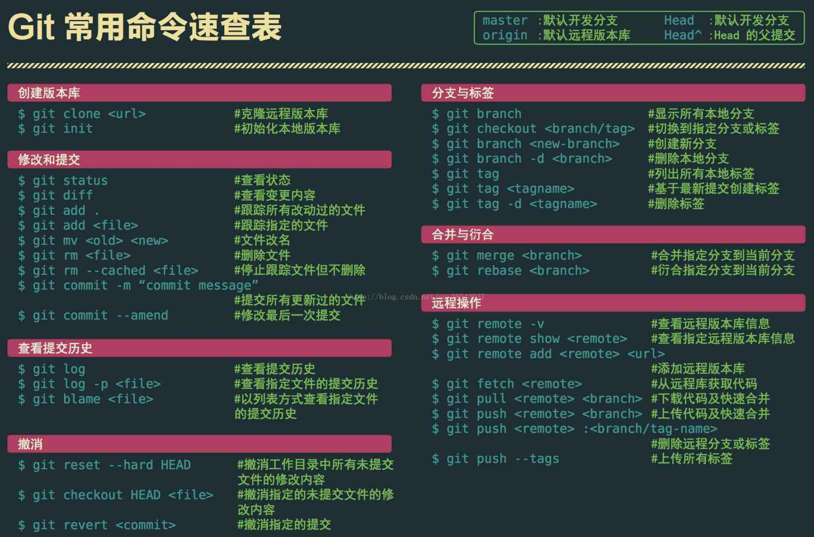