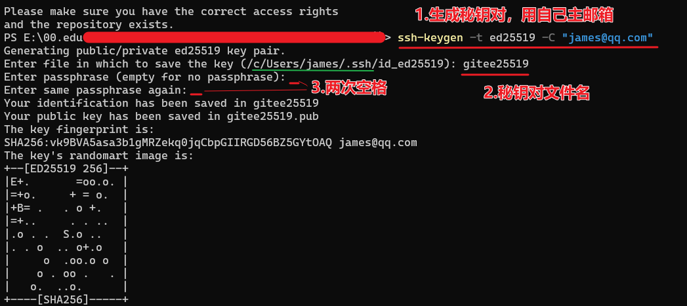
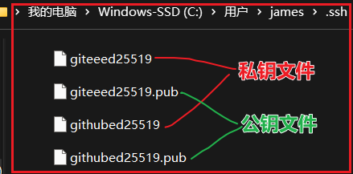
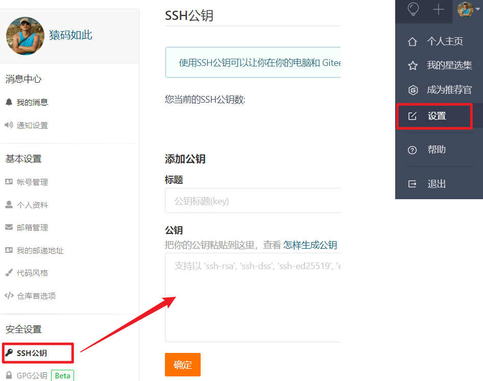
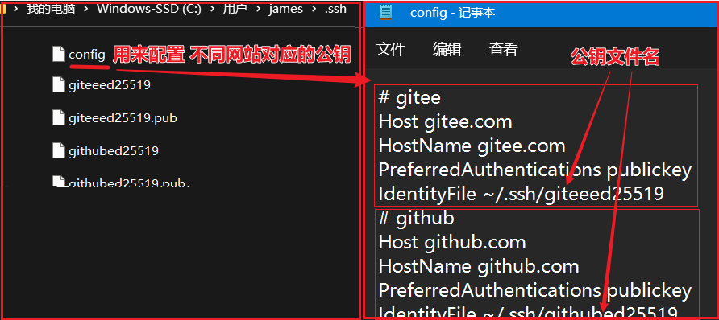
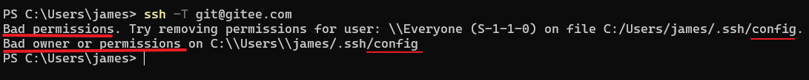
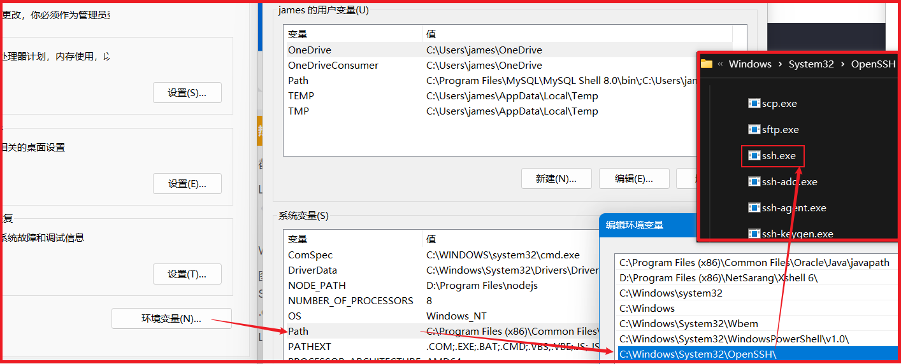
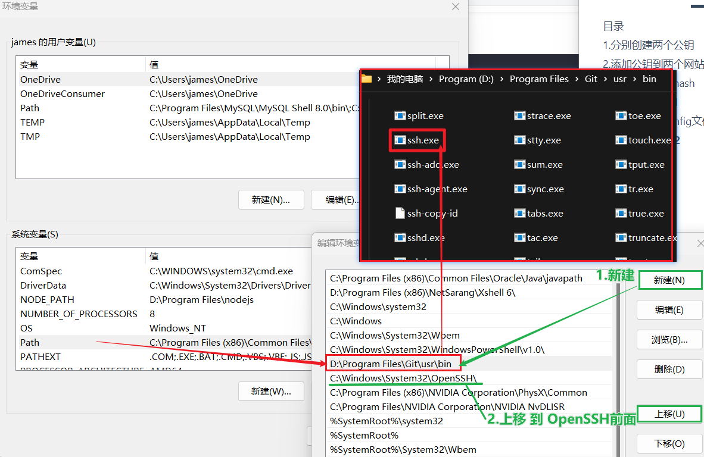
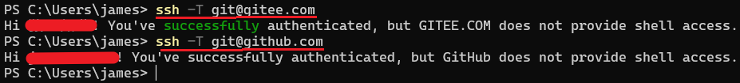
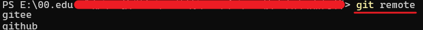

> 需求：有时候项目会需要被托管备份到不同的远程仓库，需要为他们都配置公钥
## 目录
+ 分别创建两个公钥
+ 添加公钥到两个网站
+ 本机保存公钥hash
+ 测试连接失败1
+ 添加和配置config文件
+ 测试连接失败2
+ 修改环境变量使用git的ssh.exe程序
+ 推送代码

## 1.分别创建两个公钥

+ 生成两对秘钥：
  + 调用 ssh 秘钥生成器 生成 公钥私钥，最好输入自己的主邮箱
+ 操作，进行两次如下操作：
  + 注意：输入**秘钥文件名**时，可以用 `gitee25519` 和 `github25519`，避免重名覆盖

```js
ssh-keygen -t ed25519 -C "xxxxx@xxxxx.com"  // 这里两次都输入一样的，接着输入不同的文件名
```



+ 生成结果：



## 2.添加公钥到两个网站

+ 打开并复制公钥文件内容（右键用记事本打开就行）
+ 分别到 gitee.com 和 github.com 的设置中，添加两个公钥



## 3.本机保存公钥hash

+ 首次连接时，需要将秘钥hash值自动保存到 `known_hosts` 文件中，输入`yes` 就可以了！

```js
ssh -T git@gitee.com
```


## 4.测试连接失败1

+ 再次输入并测试，会报错：
  + 原因：因为 ssh 程序不知道哪个公钥文件是 配置给gitee或github的~！ 

```js
ssh -T git@gitee.com
```


## 5.添加和配置config文件

> 怎么告诉它呢？添加 `config` 文件来告知

+ 在 .ssh 文件夹中，右键新建 `config` 文件，注意**没有后缀名**
+ 添加内容如下：

```js
# gitee
Host gitee.com
HostName gitee.com
PreferredAuthentications publickey
IdentityFile ~/.ssh/公钥文件名
```



## 6.测试连接失败2

+ 再次测试连接：`ssh -T git@gitee.com`



+ 原因：

  我们输入的`ssh` 指令实际是默认调用了 `OpenSSH` 的 `ssh.exe` 程序，它的权限策略要求很严格



## 7.修改环境变量

+ 解决方案：
  + 方案一(不推荐)：修改针对此程序的 权限策略
  + 方案二(推荐)：使用`git`自带的`ssh.exe`程序
+ 操作：
  + 步骤1：将git自带的ssh.exe所在目录 添加到 系统环境变量中的path中
  + 步骤2：将这个值上移到 OpenSSH 目录之前
  + 步骤3：重启终端，重新输入 `ssh -T git@gitee.com` 测试



+ 测试通过，然后再测试 github



## 8.推送代码

+ 添加两个仓库的远程地址到本地

```js
//添加gitee地址
$ git remote add gitee `gitee仓库地址`

//添加github地址
$ git remote add github `github仓库地址`
```

+ 查看地址：`git remote`



+ 分别推送到 gitee 和 github

```js
git push github master
git push gitee master
```

