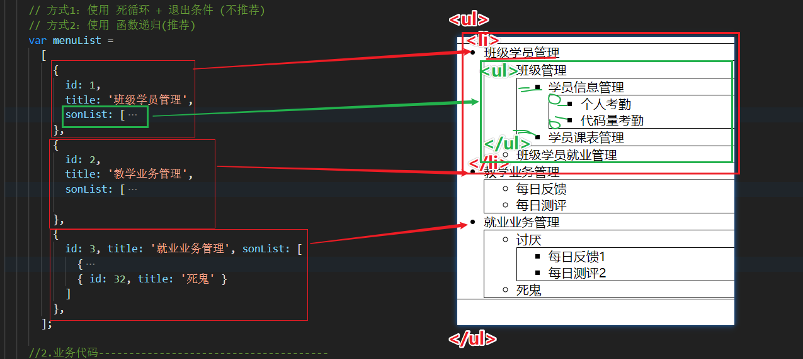
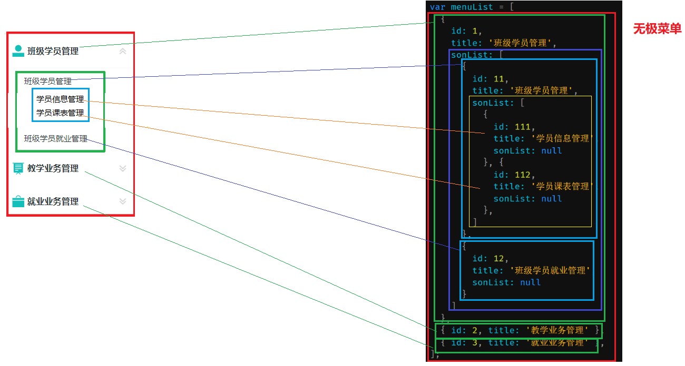

## 递归生成菜单

+ **函数递归**：函数 内部 自己 调用自己
+ **重要条件**：必须有退出条件，否则 编程 死循环，页面会停止

### 案例1：递归阶乘

```js
// 业务：求 阶乘 数字
//   求 3的阶乘：3 * 2 * 1

// 求 阶乘函数
function factorial(n) {
    if (n === 1) return 1
    return n * factorial(n - 1)
}

// 3 * factorial(2)
// 3 * 2 * factorial(1)
// 3 * 2 * 1

let res1 = factorial(3)
console.log(res1)
```

### 案例2：生成菜单

+ **思路：**只要 数据对象 有 sonList，就要生成 子代 ul

+ **图解：**



+ **代码：**

```js
<!DOCTYPE html>
<html lang="en">

<head>
  <meta charset="UTF-8">
  <meta http-equiv="X-UA-Compatible" content="IE=edge">
  <meta name="viewport" content="width=device-width, initial-scale=1.0">
  <title>树形菜单-js</title>
  <style>
    ul {
      border: 1px solid #000;
    }
  </style>
</head>

<body>
  <div></div>
  <script>
    //1.无极菜单数组 -------------------------------------------------------
    // 根据 无极菜单数组 分解生成 ul>li，有两种方式：
    // 方式1：使用 死循环 + 退出条件 (不推荐)
    // 方式2：使用 函数递归(推荐)
    var menuList =
      [
        {
          id: 1,
          title: '班级学员管理',
          sonList: [
            {
              id: 11,
              title: '班级管理',
              sonList: [
                {
                  id: 111,
                  title: '学员信息管理',
                  sonList: [
                    {
                      id: 1111,
                      title: '个人考勤',
                    },
                    {
                      id: 1112,
                      title: '代码量考勤',
                    }
                  ]
                }, {
                  id: 112,
                  title: '学员课表管理',
                  sonList: null
                }
              ]
            },
            {
              id: 12,
              title: '班级学员就业管理',
              sonList: null
            }
          ]
        },
        {
          id: 2,
          title: '教学业务管理',
          sonList: [
            { id: 21, title: '每日反馈' },
            { id: 22, title: '每日测评' }
          ]

        },
        {
          id: 3, title: '就业业务管理', sonList: [
            {
              id: 31, title: '讨厌', sonList: [
                { id: 311, title: '每日反馈1' },
                { id: 312, title: '每日测评2' }
              ]
            },
            { id: 32, title: '死鬼' }
          ]
        },
      ];

    //2.业务代码--------------------------------------
    // 2.1根据数组 创建 子菜单 ------------------------
    function makeMenu(list, arrHtml) {
      // a.添加 ul 开始标签
      arrHtml.push('<ul>');
      // b.遍历 菜单数组
      for (var i = 0; i < list.length; i++) {
        // c.取出菜单数据对象
        var item = list[i];
        // d.判断 菜单是否 存在 子菜单
        if (item.sonList && item.sonList.length > 0) {
          // d1.生成 子菜单 li 开始标签，并 设置 菜单文字
          arrHtml.push(`<li data-id="${item.id}">${item.title}`);
          // d2.【递归】生成 下级菜单(传入 子菜单数组 和 相同的 标签数组)
          makeMenu(item.sonList, arrHtml);
          // d3.生成 子菜单 li 结束标签
          arrHtml.push(`</li>`);
        } else {
          arrHtml.push(`<li data-id="${item.id}">${item.title}</li>`);
        }
      }
      arrHtml.push('</ul>');
    }

    // 2.2调用----------------------------------------
    //a.准备空数组，接收 生成的 html 标签
    var arr = [];
    //b.调用方法，将 菜单数组 和 标签数组 传入
    makeMenu(menuList, arr);
    // console.log(arr);
    //c.将 标签数组 中的 元素 用 换行符 拼接成一个 Html字符串，并设置给 div
    var strHtmlAll = arr.join('\n');
    console.log(strHtmlAll);
    document.querySelector('div').innerHTML = strHtmlAll;

  </script>
</body>

</html>
```

+ **图解补充：**

